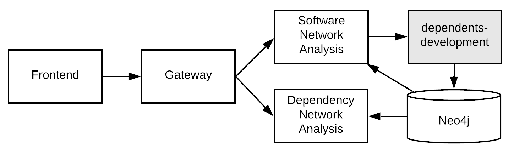

# Software Network Analysis Infrastructure
## About
Software Network Analysis is a series of microservices that perform social network analysis (SNA) and complexity measures on software call and dependency graphs of Java Maven projects hosted on GitHub. These projects can be parsed and stored as graphs in a Neo4j database using [dependent-development](https://github.com/ryanlaycock/dependents-development). The [software-network-analysis](https://github.com/ryanlaycock/software-network-analysis) microservice applies SNA metrics, including the newly proposed `network complexity`, to generate a project complexity value, and the  [dependency-network-analysis](https://github.com/ryanlaycock/dependency-network-analysis) microservice applies SNA measures to the dependency graphs of the Maven artifacts, calculating projects dependencies, dependents and importance in the overall network. The [software-network-analysis-gateway](https://github.com/ryanlaycock/software-network-analysis-gateway) wraps the services and provides a REST API to the user, and the [software-network-analysis-frontend](https://github.com/ryanlaycock/software-network-analysis-frontend) generates a basic web interface for requesting project metrics and viewing the results.

## Architecture
A basic view of the components and how they communicate with one another:

The source code and docker build for each of the projects can be found here:
- Software Network Analysis
    - [GitHub](https://github.com/ryanlaycock/software-network-analysis)
    - [Docker](https://hub.docker.com/r/ryanlaycock/software-network-analysis)
- Dependency Network Analysis
    - [GitHub](https://github.com/ryanlaycock/dependency-network-analysis)
    - [Docker](https://hub.docker.com/r/ryanlaycock/dependency-network-analysis)
- Gateway
    - [GitHub](https://github.com/ryanlaycock/software-network-analysis-gateway)
    - [Docker](https://hub.docker.com/r/ryanlaycock/software-network-analysis-gateway)
- Frontend
    - [GitHub](https://github.com/ryanlaycock/software-network-analysis-frontend)
    - [Docker](https://hub.docker.com/r/ryanlaycock/software-network-analysis-frontend)

## Build Instructions
Each component of the system has been built into a Docker container, to make local deployment as simple as running a couple of commands. There are 2 configurations for the project however. To test the complete system, from providing a project name to the frontend, the project being parsed, metrics analysed and the results displayed, [dependent-development](https://github.com/ryanlaycock/dependents-development) must be installed first, and the software-network-analysis components built on top. The installation for the dependent-development system can be slightly complicated and as this has not been modified or changed for this project, a standalone option for the system is provided and recommended for testing just the SNA components. 

Of course, the repos can all be pulled down individually and run locally. The code bases feature the standard build steps for the chosen language.

### Standalone Install
As parsing is not supported in standalone mode, a backup of the Neo4j database containing 14705 projects, of which [49 are fully parsed](parsed_projects.txt), and 45195 artifacts. This gives a good range of projects for exploring and testing, while not requiring to setup the parser. Instructions for installation are as follow:
1) Ensure Docker ([windows/mac download link](https://www.docker.com/products/docker-desktop)) is installed onto the computer you wish to install the system on.
2) Download the backup Neo4j data from http://ryanlaycock.uk/sna-neo4j-data.zip
3) Extract this to a local folder where you wish to have the Neo4j database access from docker
4) Clone this repo or simply download the [docker-compose-standalone.yml](docker-compose-standalone.yml) file to your computer
5) Edit the volumes directory environment variable in the [docker-compose-standalone.yml](docker-compose-standalone.yml) file (line 68 and 69) to be where you extracted the data folders to (Eg.`C/Users/user/Documents/data`). Neo4j inside the Docker container will then mount these folders and use them for storing data. 
6) Run `docker network create backend`
7) Run `docker-compose -f docker-compose-standalone.yml up -d` (Remove the `-d` if you wish to stream the logs from the services)

Installation is now complete. You can access the frontend from http://localhost, and the gateway can be directly accessed from http://localhost:5502. Have a look for some of the projects listed in [here](parsed_projects.txt) to try it out!

Using the standard docker commands you can check the status of each running service. Note it may take a minute or so for the frontend to compile before it can be viewed. You can check its status by running `docker logs <container ID>`.

To stop the services simply run `docker-compose -f docker-compose-standalone.yml stop`, and they can be removed with `docker-compose -f docker-compose-standalone.yml rm`. It is also important that the database folders and files are initiated **before** the containers are running. Stop them if you wish to make changes to this. 

### Integrated Install
To install the services alongside the [dependent-development](https://github.com/ryanlaycock/dependents-development) services, first follow the instructions listed there. Note the network will need creating with `docker network create backend`. If desired the Neo4j database can also be pre-populated with the data backup at http://ryanlaycock.uk/sna-neo4j-data.zip. Again, this must be done before the containers are created/while they are shut down. Once the dependents-development services are running, the SNA components can be installed as followed:
1) Clone this repo or simply download the [docker-compose-standalone.yml](docker-compose-standalone.yml) file to your PC
2) Run `docker-compose -f docker-compose.yml up -d` (note the different compose file to standalone install). This file doesn't install the Neo4j database, and the containers can be accessed via differing ports where the dependent-development service has already used them.

Installation is now complete. You can access the frontend from http://localhost/4200, and the gateway can be directly accessed from http://localhost:5502.

**NB: This project deployment process is not yet production ready. The Neo4j password is set to the default, and services are publicly exposed for testing and demonstration**
